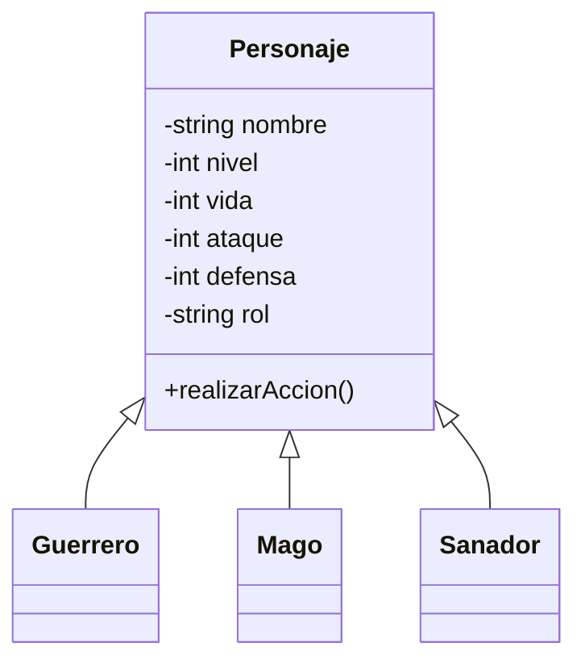
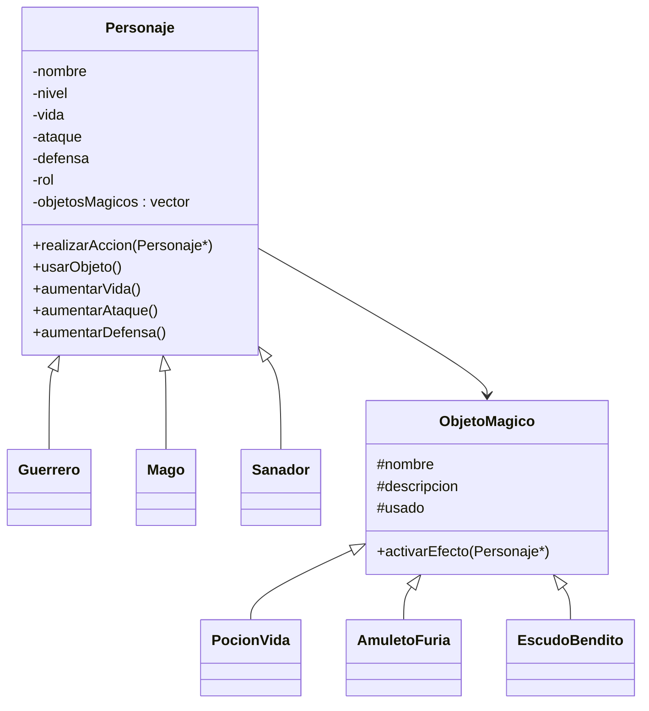

[](https://classroom.github.com/a/Wv2uUvIt)
# El gran torneo de Lyrenhold
Proyecto curso programación orientada a objetos.

# Descripcion general
Este proyecto simula el Gran Torneo de Lyrenhold, un mundo ficticio donde gremios de aventureros compiten en combates por turnos.
El objetivo es aplicar los cuatro pilares de la programación orientada a objetos (abstracción, encapsulamiento, herencia y polimorfismo) 
diseñando un sistema que gestione héroes, oponentes y objetos mágicos dentro de una arena de combate.

# Objetivo de este proyecto
El propósito no es obtener un programa perfecto, sino demostrar razonamiento y comprensión de la POO, evidenciando cómo las clases se 
relacionan y cómo los objetos interactúan entre sí para simular un combate.

# Características del Sistema
## 1. Gestión de Héroes

### Cada héroe tiene:
### Nombre
### Nivel
### Vida 
### Ataque
### Defensa
### Rol (Guerrero, Mago, Sanador)

### Cada tipo de héroe redefine su comportamiento mediante polimorfismo.

## 2. Enemigos

### Funcionan como personajes con las mismas estadísticas que los héroes, pero pertenecen al equipo enemigo.

## 3. Objetos Mágicos

### Incluye:

### Pociones de vida
### Incrementos de ataque
### Incrementos de defensa
### Los objetos tienen efectos variables y aleatorios, y solo pueden ser usados una vez por combate.

## 4. Inventario Global del Torneo

### Permite:

### Agregar objetos
### Eliminar objetos
### Listarlos
### Asignarlos a héroes
### Retirarlos antes del combate

## 5. Combate por turnos

### Cada turno se alterna entre:
### El equipo héroe
### El enemigo

### Acciones posibles:
### Atacar
### Usar objeto
### Curar (sanadores)

### El combate termina cuando un equipo pierde toda su vida.

# Diseño de clases
| Clase                                            | Rol o responsabilidad                                            | Justificacion                                                                                                                          |
|--------------------------------------------------|------------------------------------------------------------------|----------------------------------------------------------------------------------------------------------------------------------------|                
| `Personaje`                                      | Clase para los combatientes                                      | Nos permite reutilizar atributos como el nombre, la vida, el ataque, el nivel, etc                                                     |                
| `Oponente`                                       | Son los enemigos                                                 | Enfrentan a la guild                                                                                                                   |                
| `Guerrero / Mago / Sanador`                      | Poseen estilos de combate diferentes                             | Se puede aplicar polimorfismo, poseen el mismo metodo de accion, pero su ejecucion es diferente en cuanto a ataque, hechizo y curacion |
| `ObjetoMagico`                                   | Objeto que viene del inventario                                  | Define los atributos de los objetos                                                                                                    |
| `PocionVida / AmuletoFuria / EscudoBendito`      | Objetos magicos                                                  | Facilitan la variedad durante el combate, por ende modifica al heroe u oponente                                                        |
| `GemadeRayo / OrbeDeKripto / FrascoDeSalamandra` |                                                                  |                                                                                                                                        |
| `Inventario`                                     | Administra los objetos magicos                                   | Gestiona la crecacion, asignacion y eliminacion de los objetos                                                                         |
| `Arena`                                          | Lugar donde se desarrollara ek combate                           | Maneja el flujo de la batalla, alternando los turnos, aplicando los efectos y verifica el ganador                                      |

## Diagrama de clases
## Version inicial

## Version ajustada



## Version final

```mermaid
classDiagram
    class Personaje {
        - String nombre
        - int nivel
        - int vida
        - int ataque
        - int defensa
        - string rol
        - List<ObjetoMagico> objetosAsignados
        + realizarAccion()
        + recibirDanio()
        + estaVivo()
        + asignarObjeto()
        + usarObjeto()
        + mostrarInfo()
    }

    class Enemigo {
        + Enemigo()
        + ~Enemigo()
        + realizarAccion()
        
    }

    class Guerrero {
        + Guerrero()
        + ~Guerrero()
        + realizarAccion()
    }

    class Mago {
        + Mago()
        + ~Mago()
        + realizarAccion()
    }

    class Sanador {
        + Sanador()
        + ~Sanador()
        + realizarAccion()
    }

    Personaje <|-- Guerrero
    Personaje <|-- Mago
    Personaje <|-- Sanador

    class ObjetoMagico {
        - String nombre
        - String descripcion
        - bool usado
        + ObjetoMagico()
        + ~ObjetoMagico()
        + activarEfecto()
    }
    
    class PocionVida {
        + activarEfecto(Personaje*)
    }

    class AmuletoFuria {
        + activarEfecto(Personaje*)
    }

    class EscudoBendito {
        + activarEfecto(Personaje*)
    }
    
    class GemaDeRayo {
        + activarEfecto(Personaje*)
    }
    
    class OrbeDeKripto {
        + activarEfecto(Personaje*)
    }
    
    class FrascoDeSalamandra {
        + activarEfecto(Personaje*)
    }
 
    ObjetoMagico <|-- PocionVida
    ObjetoMagico <|-- AmuletoFuria
    ObjetoMagico <|-- EscudoBendito
    ObjetoMagico <|-- GemaDeRayo
    ObjetoMagico <|-- OrbeDeKripto
    ObjetoMagico <|-- FrascoDeSalamandra

    class Inventario {
        - vector<ObjetoMagico*> objetosDisponibles
        + Inventario()
        + ~Inventario()
        + agregarObjeto()
        + eliminarObjeto()
        + asignarA()
        + retirarDe()
        + consumirObjeto()
    }

    Inventario --> ObjetoMagico
    Personaje --> ObjetoMagico

    class Arena {
        - int turnoActual
        - vector<Personaje> heroes
        - vector<Personaje> enemigos
        - Inventario inventario
        - RegistroBatalla registro
        + iniciarCombate()
        + ejecutarTurno()
        + seleccionarAccion()
        + distribuirObjetosPreparacion()
        + asignarObjetoAHero()
        + verificarFin()
        + declararGanador()
    }

    Arena --> Inventario
    Arena --> RegistroBatalla
    Arena --> Personaje

    class RegistroBatalla {
        - vector<String> eventos
        + RegistroBatalla()
        + ~RegistroBatalla()
        + registrar()
        + mostrarRegistro()
    }
 ```